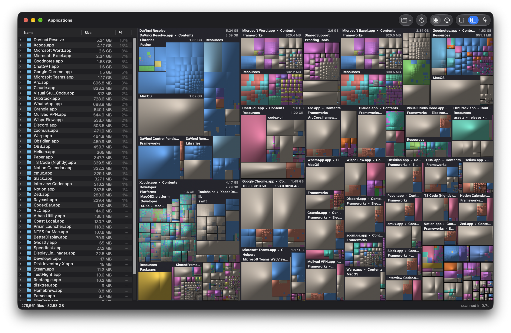

# AppleTree

A fast, native disk-space treemap for macOS, in the spirit of WizTree. Scan a
disk, see what is eating it, and clear the space back out — without handing your
file list to anyone.

<p>
  
  
</p>

Requires Apple Silicon and macOS 14 or later.

## Performance

Scanning `/Applications` (247,465 files, 12.6 GB) on an Apple M1, against
[disktree](https://github.com/tobi/disktree) 0.10.1, both engines alternated in
one run. Both report the **same allocated bytes** (12,618,919,936):

| scan engine | Scan time | Peak memory |
|---|---|---|
| **AppleTree** | **0.53–0.69 s** | **20.5–22.3 MB** |
| disktree 0.10.1 | 0.94–1.42 s | 69.0–69.3 MB |

Peak memory is the stable figure; scan time moves with machine load, so both
columns are a range over five separate sessions. The ratio is steadier than
either absolute number: **3.1× less memory** and **1.8–2.1× faster** on this
target. The margin is workload-dependent — on a directory-heavy tree the engine
lead narrows to about 1.1×.

Measured from the whole running app instead of the engine alone, on the same
machine and target, AppleTree finishes its scan in **0.62–0.88 s** — ahead of
disktree (~2.9–3.3 s), GrandPerspective 3.7.2 (5.6–8.0 s) and QDirStat 2.0.01
(7.4–8.7 s).

Everything behind those numbers, including every raw sample and what is
deliberately **not** measured, is in
[BENCHMARKS.md](docs/benchmarks/BENCHMARKS.md). Run it yourself:

```sh
cd bench && ./run.sh                            # engine comparison
cd bench && cargo run --release -- scan --compare-apps   # include the GUI apps
```

Three things do the work:

- `getattrlistbulk(2)` reads a whole directory's metadata in one syscall instead of one `stat` per file.
- A Rust worker pool keeps many directories in flight, and scan threads run at user-initiated QoS: they stay on performance cores without starving the UI.
- The treemap is laid out once and painted on every core in parallel, so zooming redraws in a couple of frames.

## Features

- Cushion-shaded treemap colored by file type, with a synced Finder-style outline list
- Prefer DaisyDisk? Switch to rings in the toolbar: click a folder to zoom in, the middle to go back
- Zoom into folders, reveal in Finder, or move to Trash (with confirmation), from the map, the rings or the list
- Keyboard navigation: arrows move the focus, Return zooms in, Escape zooms out, and ⌘↑ selects the folder holding the focused item — handy when a tile is too small to click. The title path follows the selection, so every folder above it is one click away
- Back and forward through the folders you visited: the toolbar arrows, ⌘[ and ⌘], or your mouse's side buttons. Only deliberate folder changes count, so moving the focus with the arrows never fills the history; the folders visited and the one you were browsing are saved, so the next launch opens where you left off
- Clean Up panel: finds folders that are safe to delete (caches, `node_modules`, Rust `target`, Xcode DerivedData and more) so you can trash them in one go
- AI cleanup: click "Clean up with Claude Code" (or Codex) and your own agent plans what can go, live in the panel, while the treemap lights up those folders. AppleTree does the cleanup itself, in two steps you approve: move to Trash, then delete for good. No agent installed? One click sets up Codex (free with a ChatGPT account) or Claude Code
- Or clean up with any model: Settings → Model Providers connects any OpenAI- or Anthropic-compatible endpoint — a relay, a self-hosted server (Ollama, LM Studio) or a gateway — by its base URL, protocol and key
- English, Türkçe, Deutsch, Français, Español, 简体中文 and 日本語, picked in Settings; the agent prompt stays English while the UI follows you
- Live progress while scanning, and an optional free-space block
- Native AppKit/SwiftUI, with the Liquid Glass design on macOS 26 and later
- No telemetry. AppleTree itself only goes online when the AI cleanup runs; it runs only when you click it, using your own agent, which sends folder paths and sizes from the scan (never file contents) to Anthropic or OpenAI

## Accuracy

Sizes are allocated bytes, matching `du`. Hard-linked files count once, the scan
stays on one volume, and cloud-only iCloud folders are never downloaded.
Root-only system data that no app can read is reported in the status bar instead
of hidden.

AppleTree counts every name of a hard-linked file while some other tools count
the file once, so it can list more files than they do for identical totals. The
bytes are the same either way.

## AI cleanup

The agent runs headless and read-only: it only writes a plan from the scan AppleTree already has. AppleTree then acts on it behind its own checks, whatever the plan says:

- Only paths inside your home folder, never Documents, Desktop, Photos, iCloud Drive, Mail, keychains or `~/.ssh` (build output such as `node_modules` inside them is allowed, and so are the Codex app's chat folders in `~/Documents/Codex`), never a git repository or a whole folder like `~/Library/Caches`
- Only each tool's own cache cleanup commands (`uv cache clean`, `brew cleanup`, `npm cache clean` and similar, plus `xcrun simctl` for Xcode simulator runtimes and device data), with no shell syntax
- Codex chats and projects you used in the last 2 days are left alone
- Caches of apps that are open are skipped until you quit them
- "Delete for good" removes only what this cleanup moved to the Trash

## Trust & permissions

AppleTree asks for Full Disk Access so the scan can read every folder on the
disk, including the system-protected ones that normally stay out of reach.
Everything it launches — the agent CLIs and each allowlisted cleanup command —
inherits that same grant while it runs. The agent CLIs' own sandbox settings
are a CLI-level policy, not an OS guarantee for anything they spawn.

Cleanup commands (`uv cache clean`, `brew cleanup` and so on) are resolved
through the shell's PATH, by design: these tools live in Homebrew, `~/.local/bin`,
nvm and other tool-manager locations, and AppleTree does not guess where they
are installed. Only commands matching a small allowlist of tool-specific
cleanup invocations are ever run, but what runs is whatever the PATH resolves —
the trust in your own PATH is residual.

## Build from source

Requires Xcode 16.3 or later (Swift 6.1) and Rust. The build probes your
toolchain and stops with a clear message if the Swift version is too old.

```sh
make help              # every target
make build             # build/AppleTree.app
make deploy            # build and install to /Applications
make open              # build and launch
cargo test --release   # engine tests
```

The Rust engine hands the finished tree to the Swift UI as flat arrays over a C
interface, with no copying. `AppleTree <path>` scans a specific folder.

Sign the bundle with a real `Apple Development` or `Developer ID` identity if
you intend to grant it Full Disk Access: an ad-hoc signature pins its identity
to a hash that changes on every rebuild, so macOS drops the grant each time. The
build warns when it has to fall back to ad-hoc for this reason.

## JSON CLI for agents and scripts

An optional, read-only CLI uses the same scan engine without opening the GUI
or launching an AI agent:

```sh
cargo build --locked --release --features cli --bin appletree
./target/release/appletree scan --root "$HOME/Downloads"
./target/release/appletree quick-wins --root "$HOME" --limit 20
```

`scan` lists the largest directories and files as JSON. `quick-wins` adds the
Clean Up panel's folder candidates — the same name/structure heuristics, with no
new criteria and no safety assessment — which you should review before acting.
Both report incomplete scans; allocated bytes are not a promise of reclaimable
space, and the root itself is never a candidate. Neither command modifies the
scanned files.

The CLI is built from source separately from the app; its JSON dependency is
only compiled with the `cli` feature. Its behaviour is covered by
[tests/test_cli.py](tests/test_cli.py).
